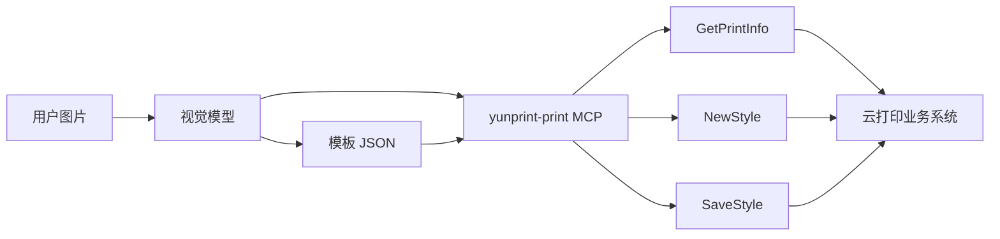
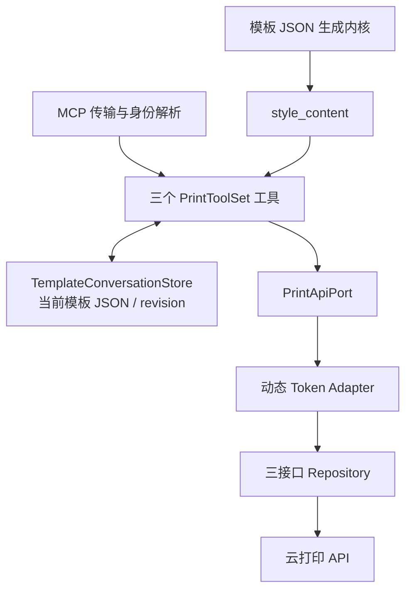
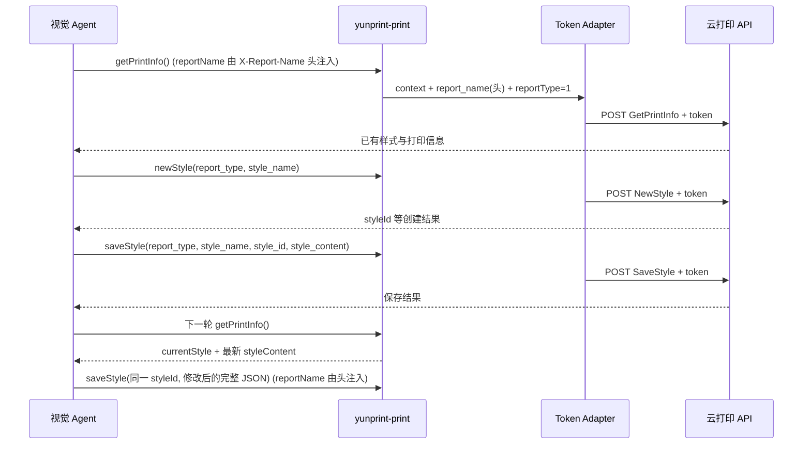

# 云打印三接口架构图

## 系统边界

```mermaid
flowchart LR
    Image["用户图片"] --> VL["视觉模型"]
    VL --> Json["模板 JSON"]
    VL --> MCP["yunprint-print MCP"]
    Json --> MCP
    MCP --> Get["GetPrintInfo"]
    MCP --> New["NewStyle"]
    MCP --> Save["SaveStyle"]
    Get --> API["云打印业务系统"]
    New --> API
    Save --> API
```

图片识别由调用方视觉模型完成，MCP 不接收图片文件。

## 代码分层

```mermaid
flowchart TB
    Mcp["MCP 传输与身份解析"] --> Tools["三个 PrintToolSet 工具"]
    Tools <--> State["TemplateConversationStore<br/>当前模板 JSON / revision"]
    Tools --> Port["PrintApiPort"]
    Port --> Adapter["动态 Token Adapter"]
    Adapter --> Repository["三接口 Repository"]
    Repository --> API["云打印 API"]
    Generator["模板 JSON 生成内核"] --> StyleContent["style_content"]
    StyleContent --> Tools
```

模板生成内核保留为内部领域能力，不额外发布 MCP 工具。

## 调用时序

```mermaid
sequenceDiagram
    participant Agent as 视觉 Agent
    participant MCP as yunprint-print
    participant Adapter as Token Adapter
    participant API as 云打印 API

    Agent->>MCP: getPrintInfo()  (reportName 由 X-Report-Name 头注入)
    MCP->>Adapter: context + report_name(头) + reportType=1
    Adapter->>API: POST GetPrintInfo + token
    API-->>Agent: 已有样式与打印信息

    Agent->>MCP: newStyle(report_type, style_name)
    Adapter->>API: POST NewStyle + token
    API-->>Agent: styleId 等创建结果

    Agent->>MCP: saveStyle(report_type, style_name, style_id, style_content)
    Adapter->>API: POST SaveStyle + token
    API-->>Agent: 保存结果

    Agent->>MCP: 下一轮 getPrintInfo()
    MCP-->>Agent: currentStyle + 最新 styleContent
    Agent->>MCP: saveStyle(同一 styleId, 修改后的完整 JSON)  (reportName 由头注入)
```
